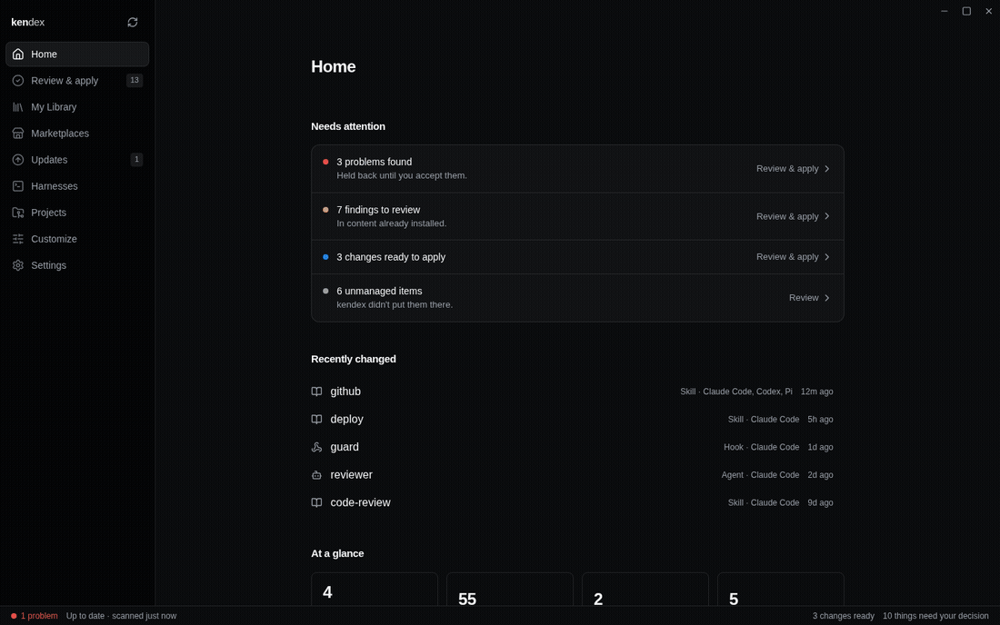

# kendex

One place to manage AI coding-tool customizations — agents, skills, hooks,
commands, MCP servers, plugins, and Pi extensions — across Claude Code,
Codex, OpenCode, Cursor, Pi, Gemini CLI, and GitHub Copilot, personally and
per-project.

Desktop app + CLI over one engine, with a community at
[kendex.ai](https://kendex.ai).



## Features

- **Install once, use everywhere** — one library serves all seven managed
  tools.
- **Author once** — one markdown file per agent or skill; kendex renders
  each tool's native format (Claude markdown, Codex TOML, Cursor rules…).
- **Preview-first** — every change shows its plan and asks before touching
  a file.
- **Reversible** — applies are journaled with crash recovery; removals go
  to a trash, never a hard delete.
- **Yours stays yours** — your edits win, your removals stick, files
  kendex didn't create are never touched.
- **Personal and per-project** — personal setup follows you everywhere;
  project setup lives in the repo and travels with it.
- **Catalogs are plain git repos** — use the default, your team's, or any
  local folder; enable them per project.
- **Sync** — see what's out of date across every tool and fix it in one
  click.
- **Point-and-click customization** — skills per agent, extra
  instructions, per-tool settings; no config editing.
- **Adopt** — bring hand-made files under management without rewriting
  them.
- **Self-updating** app and CLI, with v1 (vstack) migration built in.
- **Marketplaces** — subscribe to any repository that holds skills (no
  special format needed: skills.sh-style repos, Claude plugin
  registries, or plain folders all work), browse what it offers with a
  safety check on every package, and install with one preview.
- **Community** — the [kendex.ai](https://kendex.ai) directory and the
  whole skills.sh index, searchable inside the app; offline it degrades
  to your cached copy, never a blank page.
- **Build and publish your own** — the Mine tab scaffolds a
  ready-to-publish marketplace repo, imports packages you already have
  (with licence checks on anything that came from someone else's
  marketplace), runs the same validation installing runs, and submits
  to the community directory after verifying you can actually push to
  the repository.
- **Collections** — share a curated set across repositories with one
  link; `kendex add https://kendex.ai/c/<id>` installs the whole set at
  the exact commits the link resolved to.

## What's supported

| | Claude Code | Codex | OpenCode | Cursor* | Pi | Gemini CLI | GitHub Copilot† |
|---|:-:|:-:|:-:|:-:|:-:|:-:|:-:|
| Agents | ● | ● | ● | ● | ● | ● | ● |
| Skills | ● | ● | ● | ● | ● | ● | ● |
| Hooks | ● | ● | ● | ● | — | ● | ● |
| Commands | ● | ○ | ○ | ○ | ○ | ● | — |
| MCP servers | ● | ○ | ○ | ○ | — | ●‡ | ● |
| Plugins | ◐ | ○ | ○ | ○ | — | ○ | ◐ |
| Pi extensions | — | — | — | — | ● | — | — |

● managed · ◐ enable/disable · ○ shown read-only · — no such surface.
*Cursor is project-only.
†Copilot commands genuinely do not exist — no Copilot product reads a
file-backed slash command. A repository can only add to Copilot's
disabled lists, so a project can switch a skill or server off but cannot
switch one back on that your personal Copilot settings hold down; kendex
says so rather than pretending. Copilot also reads Claude Code's skills:
one file stays one installation, listed under the tool it belongs to.
‡Gemini records whether an MCP server is on in one file for the whole
machine, so a project can declare a server but not switch it off there.
Gemini's extensions install globally and switch on through an undocumented
rules file, so they stay read-only.

## How kendex works

```
  CATALOGS                YOUR CHOICES               YOUR TOOLS
  git repos of agents,    kendex.toml — what you     each tool's own folders
  skills, hooks, more     want, plus your tweaks     (.claude/ .codex/ .pi/ …)
       │                        │                          ▲
       ▼                        ▼                          │
  ┌──────────┐  render   ┌───────────────┐    apply   ┌────┴─────┐
  │  cached  │ ────────▶ │ finished files│ ─────────▶ │ links,   │
  │  copy    │           │ (your tweaks  │  preview,  │ copies,  │
  └──────────┘           │  baked in)    │  confirm,  │ config   │
                         └───────────────┘  journaled │ entries  │
                                                      └──────────┘
```

Four verbs, always in this order: **scan** what every tool actually has
(read-only) → **declare** what you want in one small `kendex.toml` per
place → **diff** wanted vs. actual (the Sync page) → **apply** with a
preview, transactionally.

An install, concretely — say the `github` skill into a project for Claude
Code, Codex, and Pi:

1. The catalog repo is fetched into a local cache.
2. The skill is **rendered**: catalog content with your project's added
   instructions baked in.
3. The rendered copy lands once in the project (`.agents/skills/github`).
4. Claude Code gets a link to it; Codex and Pi read the same folder
   natively. One copy — the tools can't drift apart.
5. A lock file records what was installed, from where, and a content
   fingerprint — that's how Sync knows when the catalog moved ahead.

Agents are *generated* per tool from one source file. MCP servers and
hooks are surgical edits inside a tool's own config that leave every
other key untouched. Pi extensions are npm packages, copied and
registered. Generated files are always safe to regenerate; your intent
lives only in `kendex.toml`.

## Install

Download the app or CLI for your platform from the
[latest release](https://github.com/vanillagreencom/kendex/releases/latest)
— or from [kendex.ai/download](https://kendex.ai/download).

Or build from source (Rust + Node required):

```sh
cargo build --release -p kendex-cli               # the `kendex` CLI
npm ci --prefix ui
cd crates/app && ../../ui/node_modules/.bin/tauri dev   # the desktop app
```

## Quick start

```sh
kendex owner/catalog-repo --agent rust --skill github   # declare + install
kendex list                                             # what exists, everywhere
kendex verify                                           # non-zero exit on drift
kendex refresh                                          # regenerate from sources
kendex adopt skill handmade                             # bring an unmanaged item under management
kendex apply --plan                                     # preview the full reconcile
```

Coming from v1: `kendex import` migrates manifests and locks in place
(originals are copied to the trash first), then `kendex refresh`
regenerates everything.

## The rules the engine keeps

1. Generated artifacts are always overwritable; your intent lives only in
   `kendex.toml`.
2. Nothing you set is ever clobbered, and nothing you removed is ever
   silently re-added.
3. Unmanaged files are reported, never touched. Foreign symlinks are
   conflicts, not clobber targets.
4. An item's recorded source is durable — a name collision across sources
   is a hard error naming the original.
5. Enable/disable is a lossless rename or a structured config edit that
   preserves every unrelated key.
6. One writer per scope: concurrent applies get a clear "busy" error,
   never an interleaved write.

## CLI surface

| Verb | Does |
|---|---|
| `add` (or bare `kendex <source>`) | declare + install agents/skills/… from a source |
| `remove`, `adopt`, `apply` | undeclare, take ownership, reconcile |
| `refresh` | re-resolve sources, regenerate every installation |
| `verify` | drift check; exit 1 on any failing row |
| `list` (`ls`), `check` | observe everything; sanity report |
| `source add/remove/enable/disable/refresh` | manage catalogs per scope |
| `project add/remove/list/discover` | the app's project registry |
| `report` | file an issue, routed to the asset's owner |
| `update`, `update-pi`, `import`, `init` | self-update, Pi packages, v1 migration, catalog scaffolding |

Scopes: `--scope project|global|all` (v1-compatible aliases `p/local`,
`g/user`, `both/*`), `-g` as a shortcut for global.

## Marketplaces and the community

| Verb | Does |
|---|---|
| `marketplace subscribe/unsubscribe/list/browse` | point a scope at any catalog repo; leave keeping or removing its packages |
| `marketplace new/use/mine/import` | build your own marketplace: scaffold, register an existing folder as-is, copy packages you already have |
| `marketplace check` (or `check --catalog . --strict`) | validate every package the way installing validates it — the scaffolded CI workflow runs exactly this |
| `marketplace submit [--dry-run/--status]` | preflight + submit to the kendex.ai directory (verifies your push authority first) |
| `login` / `logout` | sign in to kendex.ai with a code and a browser tab; the credential lives in your system keychain |
| `add https://kendex.ai/c/<id>` | install a shared collection — every repo, every member, one preview |

Authoring a marketplace repo is one page: [docs/AUTHORING.md](docs/AUTHORING.md)
(also rendered inside the app). This repository doubles as the default
catalog — the `agents/`, `skills/`, `hooks/` and `pi-extensions/`
directories at its root are what a fresh kendex install offers.
